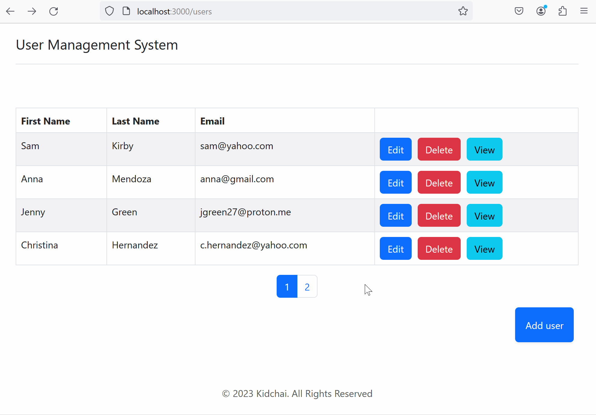
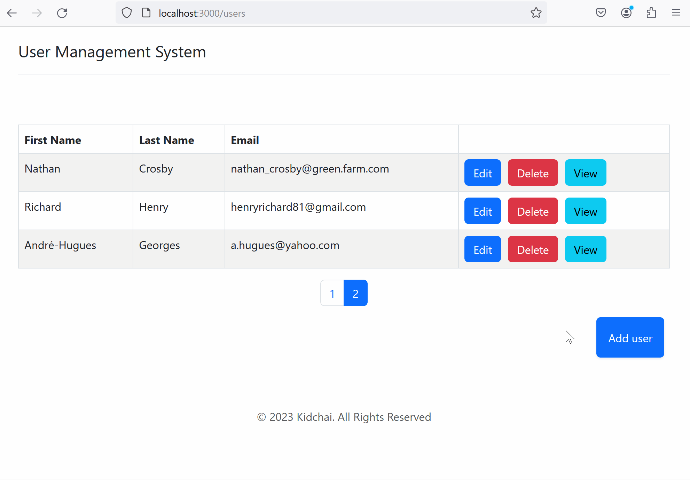

## Web application for admins to manage the users of their organization

### What is it?

It's my small study project. It's a RESTful web application for admins to manage the users of their organization.

### What is used?

**For API:** Java, Spring Boot, Spring Data JPA, Spring Security, Hibernate, MySQL

**For UI:** JavaScript, React, Bootstrap

### How does it work?

API:

- `/users` - GET - get all users
- `/users/{id}` - GET - get user by id
- `/users` - POST - create new user
- `/users/{id}` - PUT - update user by id
- `/users/{id}` - DELETE - delete user by id

UI:

`/` - main page with all users

`view/{id}` - page for viewing user by id

`/edit/{id}` - page for editing user by id

`/add/_add` - page for adding new user

`/delete/{id}` - page for deleting user by id

